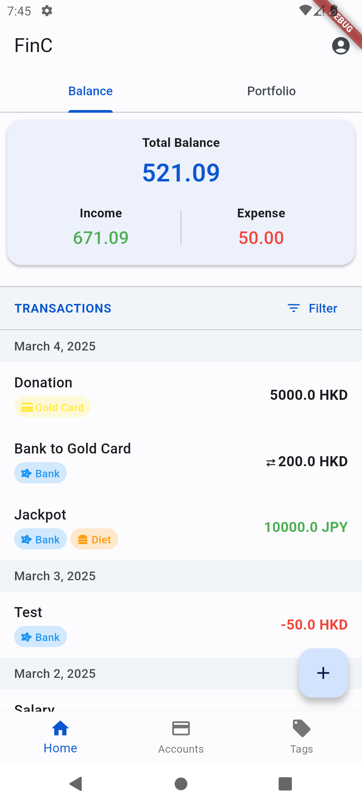

# FinC - Financial Management App
A cross-platform expense tracking application built with Flutter and Firebase, featuring multi-currency support and data synchronization.

<table>
  <tr>
    <td align="center">
       
      <em>Home Page</em>
    </td>
    <td align="center">
       
      <em>Account Page</em>
    </td>
    <td align="center">
       
      <em>Edit Transaction Page</em>
    </td>
  </tr>
</table>

## Key Features
- **Financial Tracking**: Manage expenses, income, and transfers between accounts
- **Multi-Currency Support**: Handle transactions in different currencies via CoinGecko API
- **Cross-Device Sync**: Seamless synchronization across devices with offline capability
- **Modern UI/UX**: Material 3 design with dark/light theme support and responsive layout
- **Data Visualization**: Financial summaries and transaction history

## Tech Stack
- **Frontend**: Flutter
- **Backend**: Firebase (Authentication and more), CoinGecko API for currency exchange rates
- **Storage**: Hive(local caching), Firestore(data syncing)
